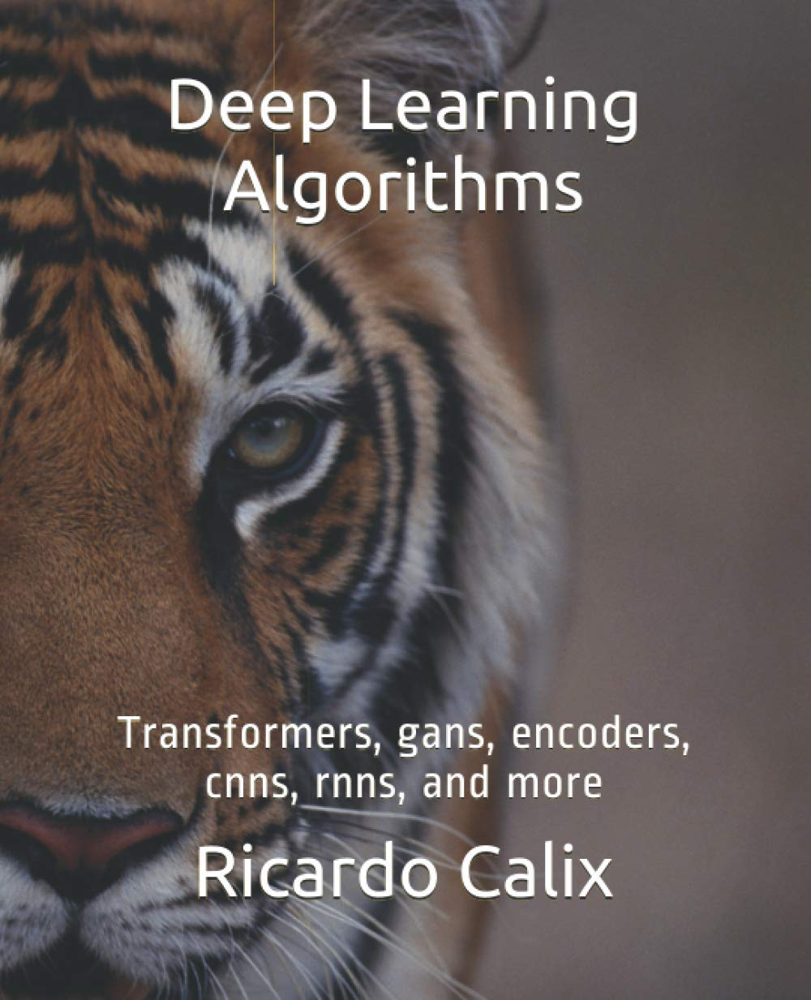

## Deep Learning Algorithms (First Edition)

I wrote this book using Tensorflow 1.0 a few years ago. All materials can be found at this link:

* https://github.com/rcalix1/Deep-learning-ML-and-tensorflow

## Available from Amazon

