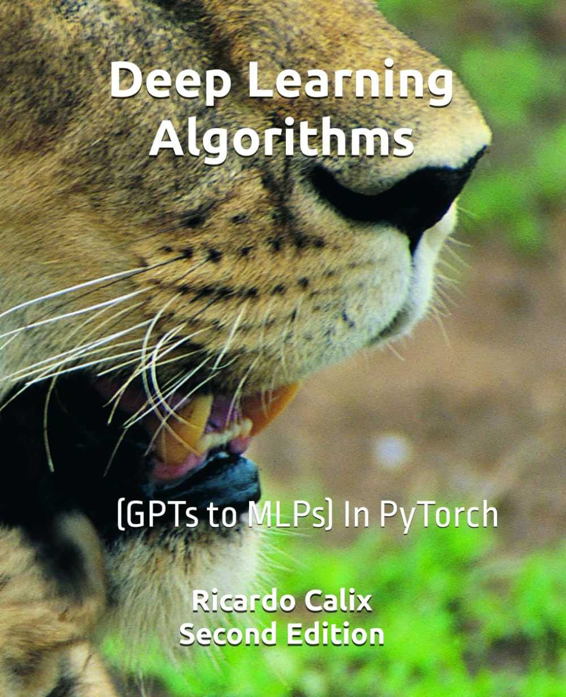

# Deep Learning Algorithms

This is the main page for my book "Deep Learning Algorithms" (Second Edition), now in PyTorch

## Books

* <a href="https://rcalix1.github.io/DeepLearningAlgorithms/SecondEdition/index.html">Available Chapters On-line</a>

